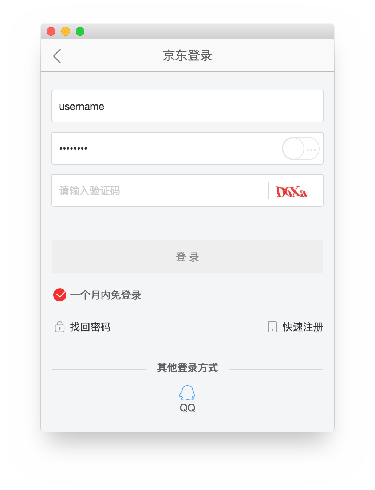
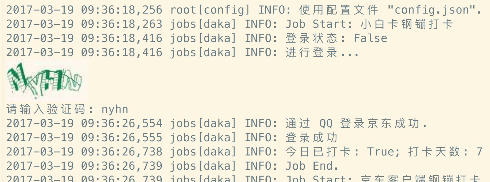

## 自动登录京东，打卡领钢镚，签到领京豆

[](https://www.python.org)


### 使用方法：

1. 安装`Python` (3.5 或更高版本）

2. 建立虚拟运行环境（可选）

3. 下载代码

4. 安装依赖：`pip install -r requirements.txt`

5. 创建配置文件（可选）

6. 运行：`python app/main.py`

<br>


## 说明

直接登录京东较复杂，不易实现，因此采用了以下两种方式进行登录：

#### 方式一：

> 2017-08-13 更新：即现在的默认分支`browser`。

借助内置浏览器登录。本方式中使用 `PyQt5` 的 `WebEngine` 构建了个简易浏览器，在其中登录京东即可。

登录后关掉浏览器窗口，程序会获取到 cookie，然后就可以继续签到了~




#### 方式二：

> 2017-08-13 更新：目前此方式[依赖的包](https://github.com/gera2ld/qqlib)存在一些问题，暂不可用，请使用「浏览器方式」登录。

通过第三方登录的方式，登录了[绑定的 QQ 帐号](https://safe.jd.com/union/index.action)，也就登录了京东。

在登录 QQ 时有时会出现需要输入验证码的情况，若是在 [iTerm2](http://www.iterm2.com/) 中运行，验证码图片会显示在终端中，直接输入即可；否则会调用系统关联应用打开验证码图片。




## 其他

### 配置文件说明

#### 帐号/密码：

可以将帐号/密码保存到配置文件中（若使用浏览器方式，可以只保存帐号），这样就不用在每次登录时手动输入了（虽然使用了 cookie 保存登录状态，但京东还是会每隔几天就让你重新登录的...）。

将默认配置文件复制为`config.json`，然后使用 [Base85](https://en.wikipedia.org/wiki/Ascii85) 方式将对应的帐号、密码编码后填入配置文件中即可，完成后是这样子的：

```json
{
  "debug": false,
  "jd": {
    "username": "b#rBMZeeX@",
    "password": "aA9+EcW-iJ"
  }
}
```

（是不是比明文安全性多了一点点呢？^_^)

编码示例（Python）：

```python
>>> import base64
>>> base64.b85encode(b'username').decode()
'b#rBMZeeX@'
```

#### 我没有小白卡/我想跳过某些任务：

将想要跳过的任务填写到配置文件中的 `jobs_skip` 中即可。比如想跳过「小白卡钢镚打卡」任务，填写 `Daka` 即可：

```json
"jobs_skip": ["Daka"]
```

跳过多个任务:

```json
"jobs_skip": ["DataStation", "Daka"]  
```

任务列表:

| 任务 | 描述 |
| --- | --- |
| DaKa | 小白卡钢镚打卡 |
| DakaApp | 京东客户端钢镚打卡 |
| BeanApp | 京东客户端签到领京豆 |
| Bean | 京东会员页签到领京豆 |
| SignJR | 京东金融签到领奖励 |
| DataStation | 流量加油站签到领流量 |
| RedPacket | 京东小金库现金红包 |

<br>


### 设置网络代理

设置环境变量 `HTTP_PROXY` / `HTTPS_PROXY` 即可。

<br>


## Example

```log
2017-03-15 10:38:48,711 root[config] INFO: 使用配置文件 "config.json".
2017-03-15 10:38:48,745 root[main] INFO: # 从文件加载 cookies 成功.
2017-03-15 10:38:48,745 jobs[daka] INFO: Job Start: 小白卡钢镚打卡
2017-03-15 10:38:49,734 jobs[daka] INFO: 登录状态: True
2017-03-15 10:38:50,642 jobs[daka] INFO: 今日已打卡: False; 打卡天数: 2
2017-03-15 10:38:50,742 jobs[daka] INFO: 打卡成功: True; Message: 打卡成功
2017-03-15 10:38:50,743 jobs[daka] INFO: Job End.
2017-03-15 10:38:50,743 jobs[daka] INFO: Job Start: 京东客户端钢镚打卡
2017-03-15 10:38:50,843 jobs[daka] INFO: 登录状态: True
2017-03-15 10:38:50,923 jobs[daka_app] INFO: 今日已打卡: False; 打卡天数: 2
2017-03-15 10:38:51,105 jobs[daka_app] INFO: 打卡成功: True; Message: 打卡成功,成功领取了0.1个钢镚！
2017-03-15 10:38:51,105 jobs[daka] INFO: Job End.
2017-03-15 10:38:51,105 jobs[daka] INFO: Job Start: 京东客户端签到领京豆
2017-03-15 10:38:51,249 jobs[daka] INFO: 登录状态: True
2017-03-15 10:38:51,344 jobs[bean_app] INFO: 今日已签到: False; 签到天数: 2
2017-03-15 10:38:51,452 jobs[bean_app] INFO: 签到成功; 获得 2 个京豆.
2017-03-15 10:38:51,452 jobs[daka] INFO: Job End.
2017-03-15 10:38:51,452 jobs[daka] INFO: Job Start: 京东会员页签到领京豆
2017-03-15 10:38:51,967 jobs[daka] INFO: 登录状态: True
2017-03-15 10:38:52,472 jobs[bean] INFO: 今日已签到: False; 现在有 1087 个京豆.
2017-03-15 10:38:52,922 jobs[bean] INFO: 签到成功，获得 20 个京豆.
2017-03-15 10:38:52,923 jobs[daka] INFO: Job End.
2017-03-15 10:38:52,923 jobs[daka] INFO: Job Start: 京东金融签到领京豆
2017-03-15 10:38:53,514 jobs[daka] INFO: 登录状态: True
2017-03-15 10:38:53,582 jobs[bean_jr] INFO: 今天已签到: False; 签到天数: 2
2017-03-15 10:38:53,681 jobs[bean_jr] INFO: 签到成功，获得 5 个京豆.
2017-03-15 10:38:53,681 jobs[daka] INFO: Job End.
=================================
= 任务数: 5; 失败数: 0
= 全部成功 ~
=================================
```
